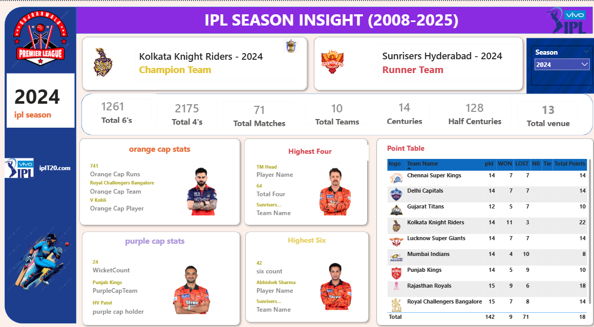
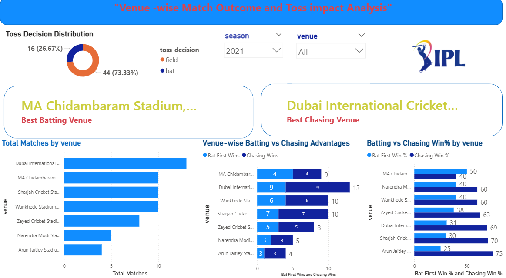
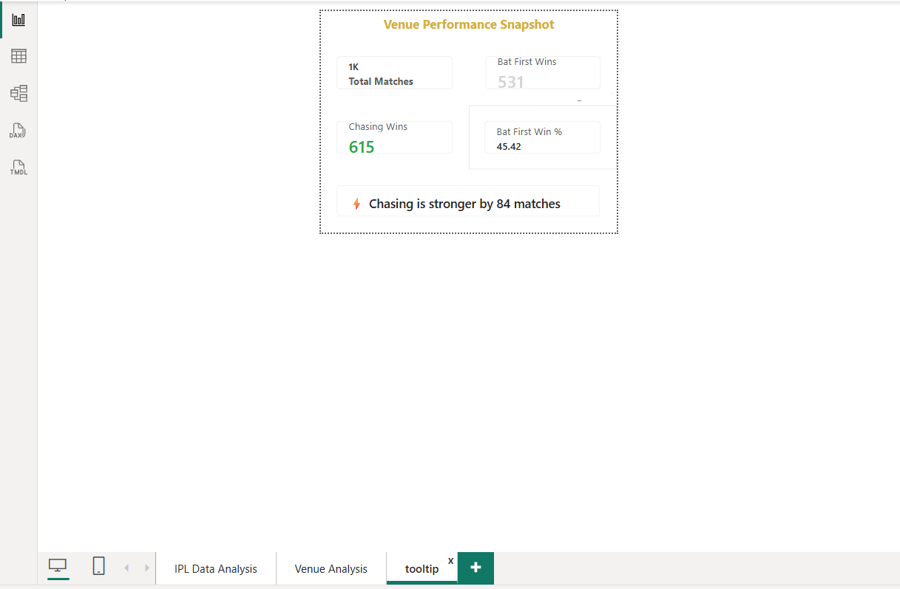

# 🏏 IPL Analytics Dashboard (2008–2025)

## 📌 Project Overview
This project presents an interactive *IPL Data Analysis Dashboard* built using Power BI to uncover insights into team performance, player achievements, and match-winning strategies.

The goal of this project is to transform raw IPL data into meaningful insights for better decision-making.

---

## 🎯 Problem Statement
Analyze IPL data to answer:
- Which teams dominate across seasons?
- Does batting first or chasing give an advantage?
- How does venue impact match outcomes?

---

## 📊 Dashboard Pages

### 🔹 Season Insights
- Champions & Runner-up teams
- Orange Cap & Purple Cap winners
- Total matches, teams, 4s, 6s
- Points Table

### 🔹 Venue Analysis
- Matches by venue
- Batting vs Chasing wins
- Win % comparison
- Toss impact on match results

### 🔹 Tooltip Insights
- Total matches
- Bat first wins vs chasing wins
- Win % comparison
- Dynamic insights

---

## 💡 Key Insights
- Chasing teams often have higher win probability
- Venue plays a critical role in match results
- Toss decisions significantly influence outcomes

---

## 🛠️ Tools & Technologies
- Power BI
- DAX
- Data Modeling
- Data Cleaning (Power Query)

---

## 📷 Dashboard Preview

### 🟡 Season Analysis

### 🔵 Venue Analysis

### 🟢 Tooltip

---

## 🚀 How to Use
1. Download the .pbix file  
2. Open in Power BI Desktop  
3. Use slicers to explore insights  

---

## 📂 Project Files
- IPL_Dashboard.pbix
- dashboard screenshots

---

## ⭐ Support
If you like this project, give it a ⭐ on GitHub!

---

## 👤 Author
Anugrah Tripathi
